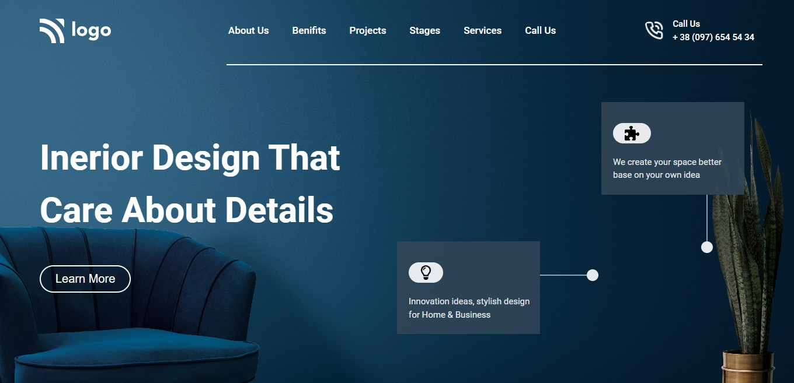

## ⭐Project 10- Interior Design Page⭐

 

## 📌 Live Site URL: <a href="https://10interior-design.netlify.app/">**Visit Now**</a>

 

## 📌 Screenshot:

 

## 📌 What I Learned:

- ### Learned how to give transparent background to button
- ### Learned about Flexbox properties
- ### Learned how to use font awsome icons

 

## 📌 Time Taken To Complete This Project:

- ### It took me 3 hours to complete this project

 

## 📌 Social Links:

